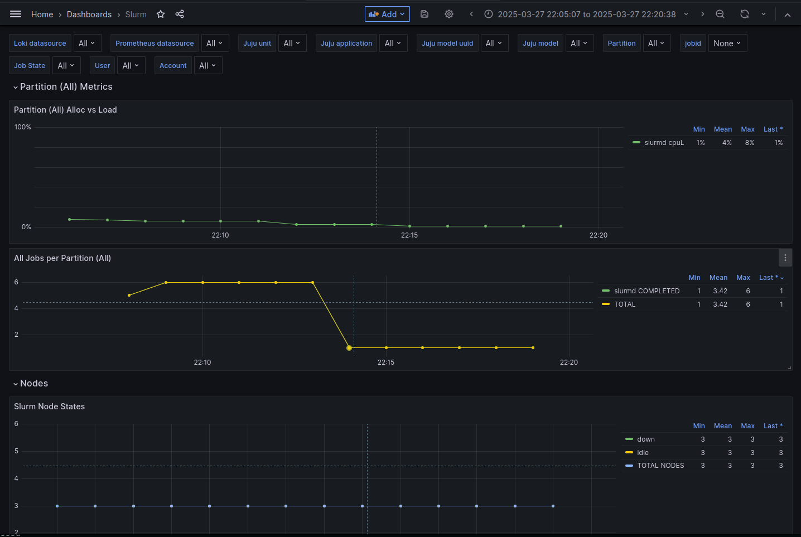
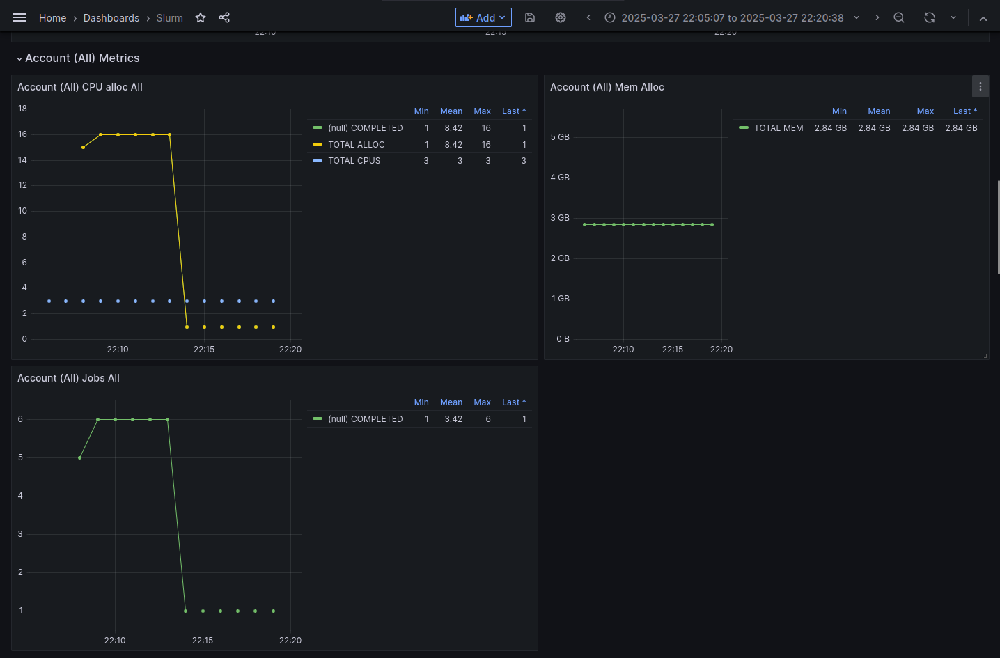
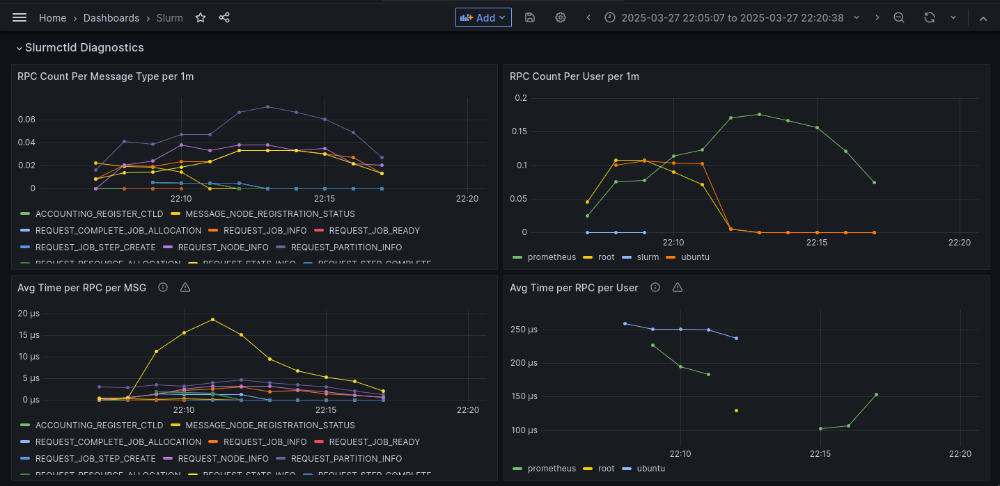
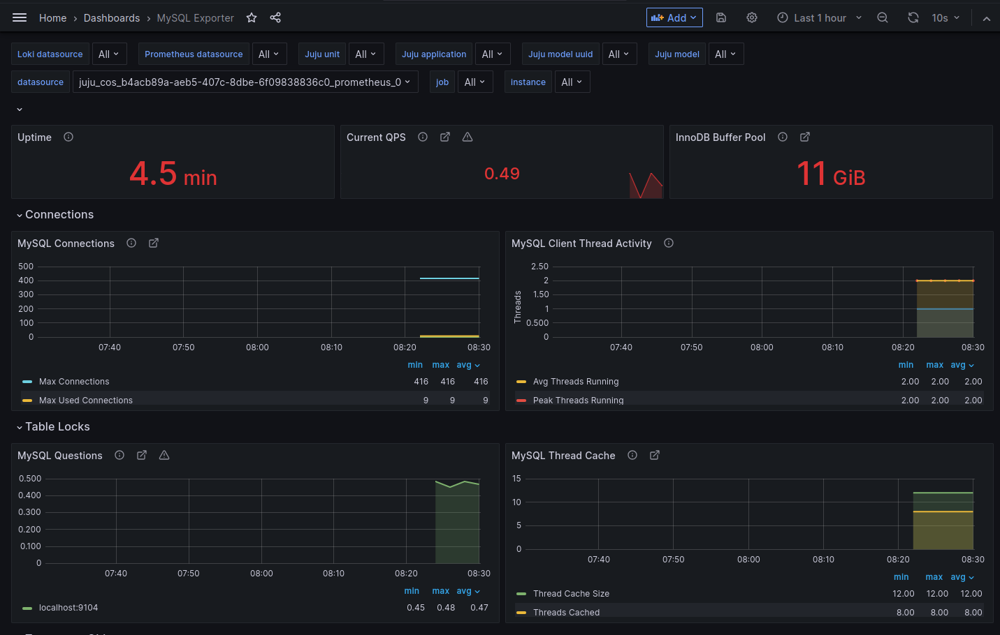
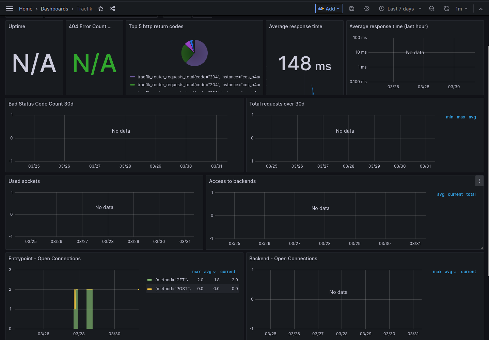

(reference-monitoring-grafana)=
# Grafana dashboards

This is an overview of all the charms used in Charmed HPC that provide dashboards for
[Grafana](https://grafana.com/), which acts as a web interface to visualize data from aggregators such
as [Prometheus](https://prometheus.io/) or [Loki](https://grafana.com/oss/loki/). See
[Grafana dashboards](https://grafana.com/docs/grafana/latest/dashboards/) for more general information on dashboards,
and {ref}`reference-monitoring-prometheus` for more information about the metrics displayed on the dashboards.

:::{note}
Any panel can be inspected using the [panel inspect view](https://grafana.com/docs/grafana/latest/panels-visualizations/panel-inspector/)
to see the exact query used to provide the panel with data.
:::

## Slurmctld

The dashboard from the `slurmctld` charm displays an overall view of the cluster, including the following information:

- CPU and memory usage per partition.
- Node state count.
- CPU and memory usage per account.
- Statistics on Slurmctld RPC messages.

## MySQL

The dashboard from the `mysql` charm displays metrics for the storage database of Slurmdbd:

- Uptime.
- Queries per second.
- Current cache size.
- Maximum number of concurrent connections.
- Thread resource usage.
- Network traffic statistics.

## Traefik K8s

The dashboard from the `traefik-k8s` charm displays metrics about the reverse proxy used when communicating
between the compute plane cluster and the monitoring/identity k8s clusters. This includes:

- Uptime.
- HTTP response code statistics.
- Response times.
- Open connections statistics.
- Raw logs for every proxied endpoint.

